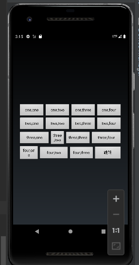
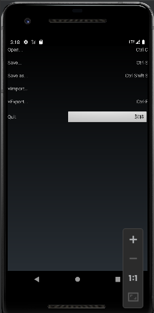
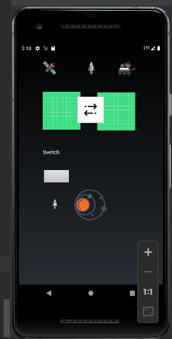
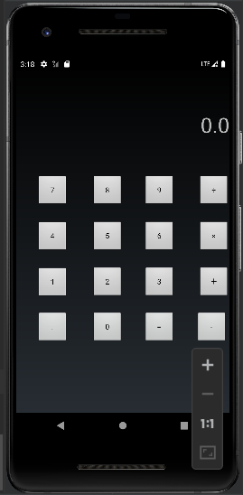

# Exp_02 Android界面布局实验
## 02_01
### 实验代码

```
package com.example.myapplication;

import androidx.appcompat.app.AppCompatActivity;

import android.app.Activity;
import android.os.Bundle;
import android.widget.Button;
import android.view.View;
import android.content.Intent;
public class MainActivity extends Activity {
Button button = null;
@Override
protected void onCreate(Bundle savedInstanceState) {
super.onCreate(savedInstanceState);
setContentView(R.layout.activity_main);

        button = (Button)findViewById(R.id.btn_one);
        button.setOnClickListener(new View.OnClickListener() {
            @Override
            public void onClick(View v) {
                Intent intent = new Intent();
                intent.setClass(MainActivity.this,linear2.class);
                startActivity(intent);
            }
        });
    }
}
```

```
<?xml version="1.0" encoding="utf-8"?>
<LinearLayout xmlns:android="http://schemas.android.com/apk/res/android"
    android:layout_width="match_parent"
    android:layout_height="match_parent"
    xmlns:app="http://schemas.android.com/apk/res-auto"
    xmlns:tools="http://schemas.android.com/tools"
    android:orientation="vertical"
    android:gravity="center"
    tools:context=".MainActivity"

    >

    <LinearLayout
        android:layout_width="369dp"
        android:layout_height="wrap_content"
        android:gravity="center"
        android:orientation="horizontal">

        <Button
            android:layout_width="0dp"
            android:layout_height="wrap_content"
            android:layout_weight="1"
            android:text="one,one" />

        <Button
            android:layout_width="0dp"
            android:layout_height="wrap_content"
            android:layout_weight="1"
            android:text="one,two" />

        <Button
            android:layout_width="0dp"
            android:layout_height="wrap_content"
            android:layout_weight="1"
            android:text="one,three" />

        <Button
            android:layout_width="0dp"
            android:layout_height="wrap_content"
            android:layout_weight="1"
            android:text="one,four" />
    </LinearLayout>
    <LinearLayout
        android:layout_width="369dp"
        android:layout_height="wrap_content"
        android:gravity="center"
        android:orientation="horizontal">

        <Button
            android:layout_width="0dp"
            android:layout_height="wrap_content"
            android:layout_weight="1"
            android:text="two,one" />

        <Button
            android:layout_width="0dp"
            android:layout_height="wrap_content"
            android:layout_weight="1"
            android:text="two,two" />

        <Button
            android:layout_width="0dp"
            android:layout_height="wrap_content"
            android:layout_weight="1"
            android:text="two,three" />

        <Button
            android:layout_width="0dp"
            android:layout_height="wrap_content"
            android:layout_weight="1"
            android:text="two,four" />
    </LinearLayout>
    <LinearLayout
        android:layout_width="369dp"
        android:layout_height="wrap_content"
        android:gravity="center"
        android:orientation="horizontal">

        <Button
            android:layout_width="0dp"
            android:layout_height="wrap_content"
            android:layout_weight="1.2"
            android:text="three,one" />

        <Button
            android:layout_width="0dp"
            android:layout_height="wrap_content"
            android:layout_weight="0.6"
            android:text="three,two" />

        <Button
            android:layout_width="0dp"
            android:layout_height="wrap_content"
            android:layout_weight="1"
            android:text="three,three" />

        <Button
            android:layout_width="0dp"
            android:layout_height="wrap_content"
            android:layout_weight="1.2"
            android:text="three,four" />
    </LinearLayout>
    <LinearLayout
        android:layout_width="369dp"
        android:layout_height="wrap_content"
        android:gravity="center"
        android:orientation="horizontal">

        <Button
            android:layout_width="0dp"
            android:layout_height="wrap_content"
            android:layout_weight="0.8"
            android:text="four,one" />

        <Button
            android:layout_width="0dp"
            android:layout_height="wrap_content"
            android:layout_weight="1.2"
            android:text="four,two" />

        <Button
            android:layout_width="0dp"
            android:layout_height="wrap_content"
            android:layout_weight="1"
            android:text="four,three" />

        <Button
            android:id="@+id/btn_one"
            android:layout_width="100dp"
            android:layout_height="50dp"
            tools:ignore="MissingConstraints"
            android:text="跳转"
            android:layout_centerHorizontal="true"

            />

    </LinearLayout>
</LinearLayout>
```
### 运行结果

## 02_02
### 实验代码
```
package com.example.myapplication;

import androidx.appcompat.app.AppCompatActivity;

import android.app.Activity;
import android.content.Intent;
import android.view.View;
import android.os.Bundle;
import android.widget.Button;

public class linear2 extends Activity {
    Button button = null;
    @Override
    protected void onCreate(Bundle savedInstanceState) {
        super.onCreate(savedInstanceState);

        setContentView(R.layout.linear2);

        button = (Button)findViewById(R.id.btn_two);
        button.setOnClickListener(new View.OnClickListener() {
            @Override
            public void onClick(View v) {
                Intent intent = new Intent();
                intent.setClass(linear2.this,constrain2.class);
                startActivity(intent);
            }
        });
    }

}
```
```
<?xml version="1.0" encoding="utf-8"?>
<LinearLayout xmlns:android="http://schemas.android.com/apk/res/android"
    android:layout_width="match_parent"
    android:layout_height="match_parent"
    xmlns:app="http://schemas.android.com/apk/res-auto"
    xmlns:tools="http://schemas.android.com/tools"
    android:orientation="vertical"
    android:gravity="center"
    tools:context=".MainActivity"

    >

    <TableLayout
        android:id="@+id/TableLayout1"
        android:layout_width="match_parent"
        android:layout_height="match_parent"
        android:gravity="top"
        >

        <TableRow
            android:layout_width="match_parent"
            android:layout_height="match_parent"
            >

            <TextView
                android:layout_width="149dp"
                android:layout_height="38dp"
                android:text="Open..." />

            <TextView
                android:layout_width="200dp"
                android:layout_height="38dp"
                android:gravity="right"
                android:text="Ctrl-O" />

        </TableRow>

        <TableRow
            android:layout_width="match_parent"
            android:layout_height="match_parent"
            >

            <TextView
                android:layout_width="130dp"
                android:layout_height="38dp"
                android:text="Save..." />

            <TextView
                android:layout_width="239dp"
                android:layout_height="38dp"
                android:text="Ctrl-S"
                android:gravity="right"/>

        </TableRow>
        <TableRow
            android:layout_width="match_parent"
            android:layout_height="match_parent"
            >

            <TextView
                android:layout_width="174dp"
                android:layout_height="38dp"
                android:text="Save as..." />

            <TextView
                android:layout_width="239dp"
                android:layout_height="38dp"
                android:text="Ctrl-Shift-S"
                android:gravity="right"/>

        </TableRow>
        <TableRow
            android:layout_width="match_parent"
            android:layout_height="match_parent"
            >

            <TextView
                android:layout_width="174dp"
                android:layout_height="38dp"
                android:text="×Import..." />

            <TextView
                android:layout_width="239dp"
                android:layout_height="38dp"

                android:gravity="right"/>

        </TableRow>
        <TableRow
            android:layout_width="match_parent"
            android:layout_height="match_parent"
            >

            <TextView
                android:layout_width="174dp"
                android:layout_height="38dp"
                android:text="×Export..." />

            <TextView
                android:layout_width="239dp"
                android:layout_height="38dp"
                android:text="Ctrl-E"
                android:gravity="right"/>

        </TableRow>

        <TableRow
            android:layout_width="match_parent"
            android:layout_height="match_parent">

            <TextView
                android:layout_width="174dp"
                android:layout_height="38dp"
                android:text="Quit" />

            <Button
                android:id="@+id/btn_two"
                android:layout_width="192dp"
                android:layout_height="match_parent"
                android:layout_centerHorizontal="true"
                android:gravity="right"
                android:text="跳转"
                tools:ignore="MissingConstraints" />

        </TableRow>


    </TableLayout>

</LinearLayout>

```
### 运行结果

## 02_03
### 实验代码
```
package com.example.myapplication;


import android.app.Activity;
import android.content.Intent;
import android.view.View;

import android.os.Bundle;
import android.widget.Button;

import androidx.appcompat.app.AppCompatActivity;

public class constrain2 extends Activity {
    Button button = null;
    @Override
    protected void onCreate(Bundle savedInstanceState) {
        super.onCreate(savedInstanceState);

        setContentView(R.layout.constrain2);

        button = (Button)findViewById(R.id.btn_three);
        button.setOnClickListener(new View.OnClickListener() {
            @Override
            public void onClick(View v) {
                Intent intent = new Intent();
                intent.setClass(constrain2.this,constrain1.class);
                startActivity(intent);
            }
        });
    }

}

```
```
<?xml version="1.0" encoding="utf-8"?>
<androidx.constraintlayout.widget.ConstraintLayout xmlns:android="http://schemas.android.com/apk/res/android"
    xmlns:app="http://schemas.android.com/apk/res-auto"
    xmlns:tools="http://schemas.android.com/tools"
    android:layout_width="match_parent"
    android:layout_height="match_parent">

    <ImageView
        android:id="@+id/imageView"
        android:layout_width="80dp"
        android:layout_height="75dp"
        android:elevation="5dp"
        app:layout_constraintBottom_toBottomOf="parent"
        app:layout_constraintEnd_toEndOf="parent"
        app:layout_constraintHorizontal_bias="0.498"
        app:layout_constraintStart_toStartOf="parent"
        app:layout_constraintTop_toBottomOf="@+id/imageView4"
        app:layout_constraintVertical_bias="0.118"
        android:src="@drawable/double_arrows" />

    <ImageView
        android:id="@+id/imageView2"
        android:layout_width="wrap_content"
        android:layout_height="wrap_content"
        app:layout_constraintBottom_toBottomOf="parent"
        app:layout_constraintEnd_toEndOf="parent"
        app:layout_constraintHorizontal_bias="0.498"
        app:layout_constraintStart_toStartOf="parent"
        app:layout_constraintTop_toBottomOf="@+id/imageView"
        app:layout_constraintVertical_bias="0.506"
        android:src="@drawable/galaxy" />

    <ImageView
        android:id="@+id/imageView3"
        android:layout_width="36dp"
        android:layout_height="32dp"
        app:layout_constraintBottom_toBottomOf="parent"
        app:layout_constraintEnd_toStartOf="@+id/imageView2"
        app:layout_constraintHorizontal_bias="0.691"
        app:layout_constraintStart_toStartOf="parent"
        app:layout_constraintTop_toBottomOf="@+id/imageView"
        android:src="@drawable/rocket_icon" />

    <ImageView
        android:id="@+id/imageView4"
        android:layout_width="64dp"
        android:layout_height="40dp"
        android:layout_marginTop="24dp"
        app:layout_constraintEnd_toEndOf="parent"
        app:layout_constraintHorizontal_bias="0.504"
        app:layout_constraintStart_toStartOf="parent"
        app:layout_constraintTop_toTopOf="parent"
        android:src="@drawable/rocket_icon" />

    <ImageView
        android:id="@+id/imageView5"
        android:layout_width="64dp"
        android:layout_height="40dp"
        app:layout_constraintEnd_toStartOf="@+id/imageView4"
        app:layout_constraintStart_toStartOf="parent"
        app:layout_constraintTop_toTopOf="@+id/imageView4"
        android:src="@drawable/space_station_icon" />

    <ImageView
        android:id="@+id/imageView6"
        android:layout_width="64dp"
        android:layout_height="40dp"
        app:layout_constraintEnd_toEndOf="parent"
        app:layout_constraintStart_toStartOf="@+id/guideline2"
        app:layout_constraintTop_toTopOf="@+id/imageView4"
        android:src="@drawable/rover_icon" />

    <Switch
        android:id="@+id/switch1"
        android:layout_width="106dp"
        android:layout_height="39dp"
        android:layout_marginStart="68dp"
        android:text="Switch"
        app:layout_constraintBottom_toBottomOf="parent"
        app:layout_constraintStart_toStartOf="parent"
        app:layout_constraintTop_toTopOf="parent"
        app:layout_constraintVertical_bias="0.425" />

    <ImageView
        android:id="@+id/imageView7"
        android:layout_width="wrap_content"
        android:layout_height="wrap_content"
        android:layout_marginTop="36dp"
        app:layout_constraintBottom_toBottomOf="parent"
        app:layout_constraintEnd_toEndOf="parent"
        app:layout_constraintHorizontal_bias="0.224"
        app:layout_constraintStart_toStartOf="parent"
        app:layout_constraintTop_toTopOf="parent"
        app:layout_constraintVertical_bias="0.145"
        android:src="@drawable/ic_launcher_background" />

    <ImageView
        android:id="@+id/imageView8"
        android:layout_width="wrap_content"
        android:layout_height="wrap_content"
        android:src="@drawable/ic_launcher_background"
        app:layout_constraintBottom_toBottomOf="parent"
        app:layout_constraintEnd_toEndOf="parent"
        app:layout_constraintHorizontal_bias="0.739"
        app:layout_constraintStart_toStartOf="parent"
        app:layout_constraintTop_toTopOf="parent"
        app:layout_constraintVertical_bias="0.206" />

    <androidx.constraintlayout.widget.Guideline
        android:id="@+id/guideline2"
        android:layout_width="wrap_content"
        android:layout_height="wrap_content"
        android:orientation="vertical"
        app:layout_constraintGuide_percent="0.5" />

    <androidx.constraintlayout.widget.Guideline
        android:id="@+id/guideline3"
        android:layout_width="wrap_content"
        android:layout_height="wrap_content"
        android:orientation="vertical"
        app:layout_constraintGuide_percent="0.25547445" />

    <androidx.constraintlayout.widget.Guideline
        android:id="@+id/guideline4"
        android:layout_width="wrap_content"
        android:layout_height="wrap_content"
        android:orientation="vertical"
        app:layout_constraintGuide_percent="0.75" />

    <androidx.constraintlayout.widget.Guideline
        android:id="@+id/guideline5"
        android:layout_width="wrap_content"
        android:layout_height="wrap_content"
        android:orientation="horizontal"
        app:layout_constraintGuide_percent="0.15" />

    <Button
        android:id="@+id/btn_three"
        android:layout_width="79dp"
        android:layout_height="43dp"
        android:layout_marginStart="68dp"
        app:layout_constraintBottom_toBottomOf="parent"
        app:layout_constraintStart_toStartOf="parent"
        app:layout_constraintTop_toTopOf="parent"
        app:layout_constraintVertical_bias="0.539"
        app:srcCompat="@drawable/ic_launcher_background" />

</androidx.constraintlayout.widget.ConstraintLayout>
```
### 运行结果

## 02_04
### 实验代码
```
package com.example.myapplication;


import android.app.Activity;
import android.content.Intent;
import android.view.View;
import android.os.Bundle;
import android.widget.Button;

public class constrain1 extends Activity {
    Button button = null;
    @Override
    protected void onCreate(Bundle savedInstanceState) {
        super.onCreate(savedInstanceState);

        setContentView(R.layout.constrain1);

    }

}
```
```
<?xml version="1.0" encoding="utf-8"?>
<androidx.constraintlayout.widget.ConstraintLayout xmlns:android="http://schemas.android.com/apk/res/android"
    xmlns:app="http://schemas.android.com/apk/res-auto"
    xmlns:tools="http://schemas.android.com/tools"
    android:layout_width="match_parent"
    android:layout_height="match_parent">

    <Button
        android:id="@+id/button48"
        android:layout_width="60dp"
        android:layout_height="60dp"
        android:layout_marginStart="40dp"
        android:layout_marginBottom="134dp"
        android:text="."
        app:layout_constraintBottom_toBottomOf="parent"
        app:layout_constraintStart_toStartOf="parent"
        app:layout_constraintTop_toBottomOf="@+id/button44" />

    <Button
        android:id="@+id/button47"
        android:layout_width="0dp"
        android:layout_height="60dp"
        android:layout_marginEnd="41dp"
        android:text="="
        app:layout_constraintEnd_toStartOf="@+id/button46"
        app:layout_constraintStart_toEndOf="@+id/button49"
        app:layout_constraintTop_toTopOf="@+id/button49" />

    <Button
        android:id="@+id/button49"
        android:layout_width="0dp"
        android:layout_height="60dp"
        android:layout_marginStart="146dp"
        android:layout_marginEnd="40dp"
        android:text="0"
        app:layout_constraintEnd_toStartOf="@+id/button47"
        app:layout_constraintStart_toStartOf="parent"
        app:layout_constraintTop_toTopOf="@+id/button48" />

    <Button
        android:id="@+id/button46"
        android:layout_width="0dp"
        android:layout_height="60dp"
        android:layout_marginEnd="4dp"
        android:text="-"
        app:layout_constraintEnd_toEndOf="parent"
        app:layout_constraintStart_toEndOf="@+id/button47"
        app:layout_constraintTop_toTopOf="@+id/button47" />

    <Button
        android:id="@+id/button44"
        android:layout_width="60dp"
        android:layout_height="60dp"
        android:layout_marginStart="40dp"
        android:layout_marginBottom="26dp"
        android:text="1"
        app:layout_constraintBottom_toTopOf="@+id/button48"
        app:layout_constraintStart_toStartOf="parent"
        app:layout_constraintTop_toBottomOf="@+id/button40" />

    <Button
        android:id="@+id/button42"
        android:layout_width="0dp"
        android:layout_height="60dp"
        android:layout_marginTop="176dp"
        android:text="＋"
        app:layout_constraintEnd_toEndOf="parent"
        app:layout_constraintStart_toEndOf="@+id/button43"
        app:layout_constraintTop_toTopOf="@+id/button20" />

    <Button
        android:id="@+id/button43"
        android:layout_width="0dp"
        android:layout_height="60dp"
        android:layout_marginTop="176dp"
        android:layout_marginEnd="45dp"
        android:text="3"
        app:layout_constraintEnd_toStartOf="@+id/button42"
        app:layout_constraintStart_toEndOf="@+id/button45"
        app:layout_constraintTop_toTopOf="@+id/button19" />

    <Button
        android:id="@+id/button45"
        android:layout_width="0dp"
        android:layout_height="60dp"
        android:layout_marginStart="146dp"
        android:layout_marginTop="176dp"
        android:layout_marginEnd="40dp"
        android:text="2"
        app:layout_constraintEnd_toStartOf="@+id/button43"
        app:layout_constraintStart_toStartOf="parent"
        app:layout_constraintTop_toTopOf="@+id/button18" />

    <Button
        android:id="@+id/button40"
        android:layout_width="60dp"
        android:layout_height="60dp"
        android:layout_marginStart="40dp"
        android:layout_marginBottom="28dp"
        android:text="4"
        app:layout_constraintBottom_toTopOf="@+id/button44"
        app:layout_constraintStart_toStartOf="parent"
        app:layout_constraintTop_toBottomOf="@+id/button18" />

    <Button
        android:id="@+id/button38"
        android:layout_width="0dp"
        android:layout_height="60dp"
        android:layout_marginTop="88dp"
        android:text="×"
        app:layout_constraintEnd_toEndOf="parent"
        app:layout_constraintStart_toEndOf="@+id/button39"
        app:layout_constraintTop_toTopOf="@+id/button20" />

    <Button
        android:id="@+id/button39"
        android:layout_width="0dp"
        android:layout_height="60dp"
        android:layout_marginTop="88dp"
        android:layout_marginEnd="45dp"
        android:text="6"
        app:layout_constraintEnd_toStartOf="@+id/button38"
        app:layout_constraintStart_toEndOf="@+id/button41"
        app:layout_constraintTop_toTopOf="@+id/button19" />

    <Button
        android:id="@+id/button41"
        android:layout_width="0dp"
        android:layout_height="60dp"
        android:layout_marginStart="146dp"
        android:layout_marginTop="88dp"
        android:layout_marginEnd="40dp"
        android:text="5"
        app:layout_constraintEnd_toStartOf="@+id/button39"
        app:layout_constraintStart_toStartOf="parent"
        app:layout_constraintTop_toTopOf="@+id/button18" />

    <Button
        android:id="@+id/button18"
        android:layout_width="60dp"
        android:layout_height="60dp"
        android:layout_marginStart="40dp"
        android:layout_marginBottom="28dp"
        android:text="7"
        app:layout_constraintBottom_toTopOf="@+id/button40"
        app:layout_constraintStart_toStartOf="parent"
        app:layout_constraintTop_toBottomOf="@+id/textView3" />

    <Button
        android:id="@+id/button19"
        android:layout_width="0dp"
        android:layout_height="60dp"
        android:layout_marginStart="146dp"
        android:layout_marginEnd="40dp"
        android:text="8"
        app:layout_constraintEnd_toStartOf="@+id/button20"
        app:layout_constraintStart_toStartOf="parent"
        app:layout_constraintTop_toTopOf="@+id/button18" />

    <Button
        android:id="@+id/button20"
        android:layout_width="0dp"
        android:layout_height="60dp"
        android:layout_marginEnd="45dp"
        android:text="9"
        app:layout_constraintEnd_toStartOf="@+id/button21"
        app:layout_constraintStart_toEndOf="@+id/button19"
        app:layout_constraintTop_toTopOf="@+id/button19" />

    <Button
        android:id="@+id/button21"
        android:layout_width="0dp"
        android:layout_height="60dp"
        android:text="÷"
        app:layout_constraintEnd_toEndOf="parent"
        app:layout_constraintStart_toEndOf="@+id/button20"
        app:layout_constraintTop_toTopOf="@+id/button20" />

    <TextView
        android:id="@+id/textView2"
        android:layout_width="122dp"
        android:layout_height="0dp"
        android:layout_marginStart="4dp"
        android:layout_marginTop="57dp"
        android:layout_marginBottom="37dp"
        android:text="Input"
        android:textSize="40dp"
        app:layout_constraintBottom_toTopOf="@+id/textView3"
        app:layout_constraintStart_toStartOf="parent"
        app:layout_constraintTop_toTopOf="parent" />

    <TextView
        android:id="@+id/textView3"
        android:layout_width="123dp"
        android:layout_height="68dp"
        android:layout_marginStart="1dp"
        android:layout_marginBottom="56dp"
        android:gravity="right"
        android:text="0.0"
        android:textSize="40dp"
        app:layout_constraintBottom_toTopOf="@+id/button18"
        app:layout_constraintEnd_toEndOf="parent"
        app:layout_constraintHorizontal_bias="1.0"
        app:layout_constraintStart_toStartOf="parent"
        app:layout_constraintTop_toBottomOf="@+id/textView2" />

</androidx.constraintlayout.widget.ConstraintLayout>
```
### 运行结果
