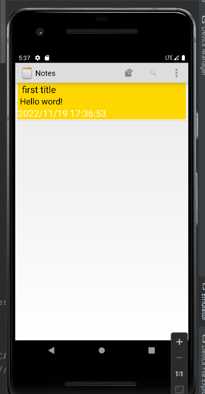
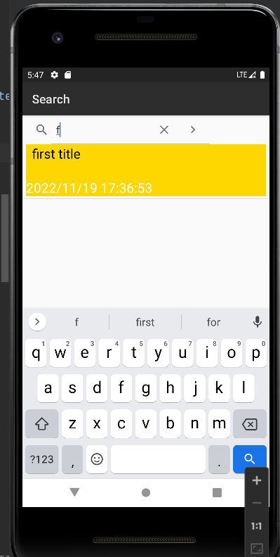

# NotePad
This is an AndroidStudio rebuild of google SDK sample NotePad
# 期中实验 #
##NoteList界面中笔记条目增加时间戳显示##

###部分实现代码###
```agsl
1
private static final String[] PROJECTION = new String[] {
NotePad.Notes._ID, 
NotePad.Notes.COLUMN_NAME_TITLE, 
NotePad.Notes.COLUMN_NAME_MODIFICATION_DATE,
};
2
Cursor cursor = managedQuery(
getIntent().getData(),            
PROJECTION,                       
null,                          
null,                            
NotePad.Notes.DEFAULT_SORT_ORDER  
);
// The names of the cursor columns to display in the view, initialized to the title column
String[] dataColumns = {  NotePad.Notes.COLUMN_NAME_TITLE , NotePad.Notes.COLUMN_NAME_MODIFICATION_DATE} ;
int[] viewIDs = { android.R.id.text1,android.R.id.text2};
SimpleCursorAdapter adapter
= new SimpleCursorAdapter(
this,                             // The Context for the ListView
R.layout.noteslist_item,          // Points to the XML for a list item
cursor,                           // The cursor to get items from
dataColumns,
viewIDs
);
// Sets the ListView's adapter to be the cursor adapter that was just created.
setListAdapter(adapter);
<TextView
android:id="@android:id/text1"
android:layout_width="match_parent"
android:layout_height="wrap_content"
android:background="@color/yellow"
android:gravity="center_vertical"
android:paddingLeft="10dp"
android:singleLine="true"
android:textAppearance="?android:attr/textAppearanceLarge"
android:textColor="@color/black" />
3
<TextView
android:id="@android:id/text1"
android:layout_width="match_parent"
android:layout_height="wrap_content"
android:background="@color/yellow"
android:gravity="center_vertical"
android:paddingLeft="10dp"
android:singleLine="true"
android:textAppearance="?android:attr/textAppearanceLarge"
android:textColor="@color/black" />
<TextView
android:id="@android:id/text1"
android:layout_width="match_parent"
android:layout_height="wrap_content"
android:background="@color/yellow"
android:gravity="center_vertical"
android:paddingLeft="10dp"
android:singleLine="true"
android:textAppearance="?android:attr/textAppearanceLarge"
android:textColor="@color/black" />
<TextView
android:id="@android:id/text2"
android:layout_width="match_parent"
android:layout_height="wrap_content"
android:layout_gravity="center_vertical"
android:background="@color/yellow"
android:textAppearance="?android:attr/textAppearanceLarge"
android:textColor="@color/white"
android:singleLine="true"/>
4
String[] dataColumns = { NotePad.Notes.COLUMN_NAME_TITLE , NotePad.Notes.COLUMN_NAME_NOTE,NotePad.Notes.COLUMN_NAME_MODIFICATION_DATE} ;
int[] viewIDs = { android.R.id.text1, R.id.text3,android.R.id.text2, };
```

##添加笔记查询功能（根据标题）##

###部分实现代码###

```agsl
1
private static final String[] PROJECTION = new String[] {
NotePad.Notes._ID,
NotePad.Notes.COLUMN_NAME_TITLE,
NotePad.Notes.COLUMN_NAME_MODIFICATION_DATE,
};
2
public boolean onQueryTextChange(String newText) {
String selection = NotePad.Notes.COLUMN_NAME_TITLE + " Like ? ";
String[] selectionArgs = { "%"+newText+"%" };
String[] dataColumns = { NotePad.Notes.COLUMN_NAME_TITLE, NotePad.Notes.COLUMN_NAME_MODIFICATION_DATE} ;
int[] viewIDs = { android.R.id.text1,android.R.id.text2};
cursor = managedQuery(
getIntent().getData(),          
PROJECTION,                       
selection,                       
selectionArgs,                    
NotePad.Notes.DEFAULT_SORT_ORDER  
);
adapter = new SimpleCursorAdapter(
this,                             
R.layout.noteslist_item,        
cursor,                         
dataColumns,			  
viewIDs				  
);
setListAdapter(adapter);
return true;
}
```

##UI美化##

###部分实现代码###
```agsl
<TextView
android:id="@android:id/text1"
android:layout_width="match_parent"
android:layout_height="wrap_content"
android:background="@color/yellow"
android:gravity="center_vertical"
android:paddingLeft="10dp"
android:singleLine="true"
android:textAppearance="?android:attr/textAppearanceLarge"
android:textColor="@color/black" />
<TextView
android:id="@+id/text3"
android:layout_width="match_parent"
android:layout_height="wrap_content"
android:background="@color/yellow"
android:ellipsize="end"
android:gravity="center_vertical"
android:paddingLeft="5dip"
android:singleLine="true"
android:textAppearance="?android:attr/textAppearanceLarge"
android:textSize="20dp" />
<TextView
android:id="@android:id/text2"
android:layout_width="match_parent"
android:layout_height="wrap_content"
android:layout_gravity="center_vertical"
android:background="@color/yellow"
android:textAppearance="?android:attr/textAppearanceLarge"
android:textColor="@color/white"
android:singleLine="true"/>
```


##正文缩略显示##

###部分实现代码###
```agsl
1
<TextView
android:id="@+id/text3"
android:layout_width="match_parent"
android:layout_height="wrap_content"
android:background="@color/yellow"
android:ellipsize="end"
android:gravity="center_vertical"
android:paddingLeft="5dip"
android:singleLine="true"
android:textAppearance="?android:attr/textAppearanceLarge"
android:textSize="20dp" />
2
String[] dataColumns = { NotePad.Notes.COLUMN_NAME_TITLE , NotePad.Notes.COLUMN_NAME_NOTE,NotePad.Notes.COLUMN_NAME_MODIFICATION_DATE} ;
int[] viewIDs = { android.R.id.text1, R.id.text3,android.R.id.text2, };
```


