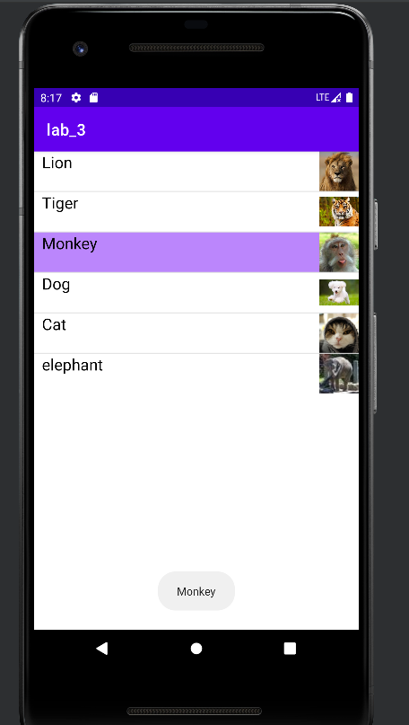
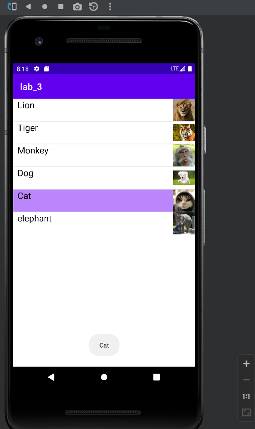

# Exp_03 Android界面组件实验
## 03_01 Android ListView的用法
### 运行结果：


 ### 部分代码：
```
SimpleAdapter simpleAdapter = new SimpleAdapter(this, ListItems, R.layout. activity_e1, new String[]{"header", "images"}, new int[]{R.id.header, R.id.images});
        final ListView list = (ListView) findViewById(R.id.mylist);
        list.setAdapter(simpleAdapter);
         list.setOnItemClickListener(new AdapterView.OnItemClickListener() {
            public void onItemClick(AdapterView<?> parent, View view, int position, long id) {
                int flag = 0;
                System.out.println(names[position] + position + "被单击");
                switch (flag) {
                    case 0:
                        view.setSelected(true);
                        CharSequence text = names[position];
                        int duration = Toast.LENGTH_SHORT;
                        Toast toast = Toast.makeText(MainActivity.this, text, duration);
                        toast.show();
                        flag = 1;
                        break;
                    case 1:
                        view.setSelected(false);
                        CharSequence text1 = names[position];
                        int duration1 = Toast.LENGTH_SHORT;
                        Toast toast1 = Toast.makeText(MainActivity.this, text1, duration1);
                        toast1.show();
                        flag = 0;
                        break;
                }
            }
        });
```
