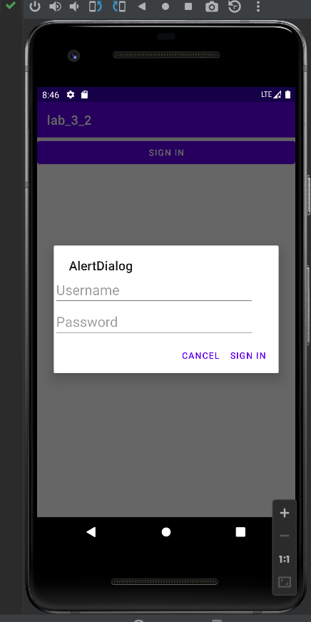
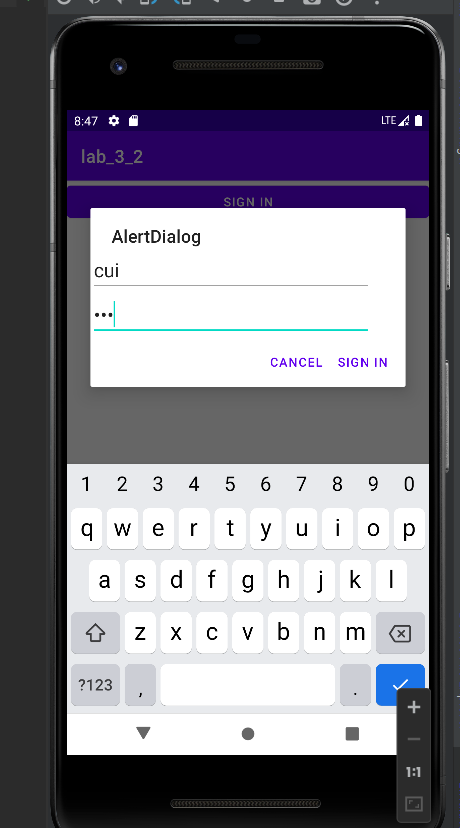

# Exp_03 Android界面组件实验
## 03_02 创建自定义布局的AlertDialog
### 运行结果：


### 部分代码：
```
    public void customView(View source){
        TableLayout loginForm=(TableLayout)getLayoutInflater()
                .inflate(R.layout.activity_main,null);
        new AlertDialog.Builder(this)
                .setTitle("AlertDialog")
                .setView(loginForm)
                .setPositiveButton("Sign in", new DialogInterface.OnClickListener() {
                    @Override
                    public void onClick(DialogInterface dialogInterface, int i) {
                    }
                })
                .setNegativeButton("Cancel", new DialogInterface.OnClickListener() {
                    @Override
                    public void onClick(DialogInterface dialogInterface, int i) {
                    }
                })
                .create()
                .show();
    }
```