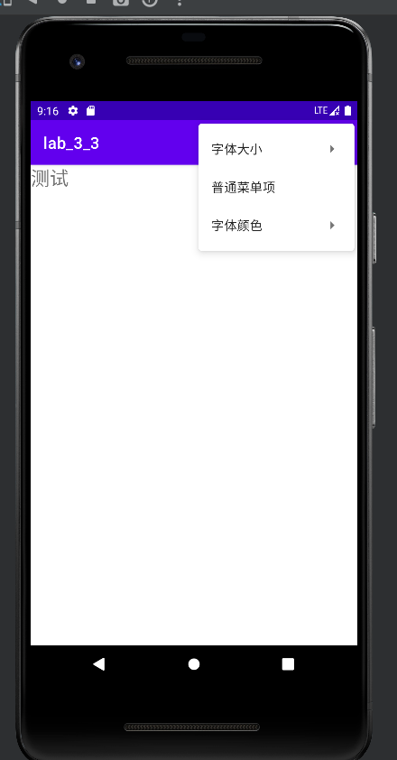
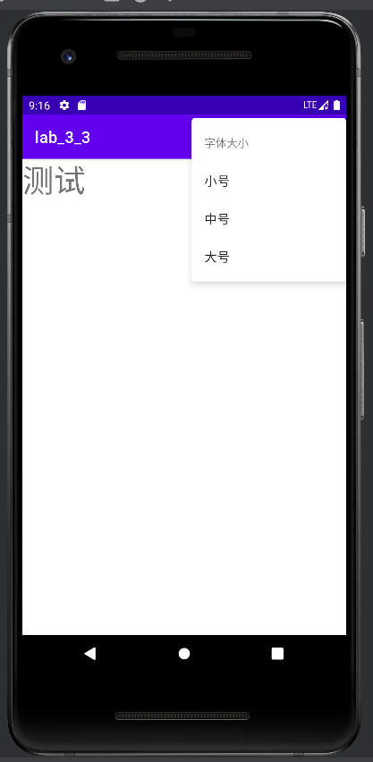
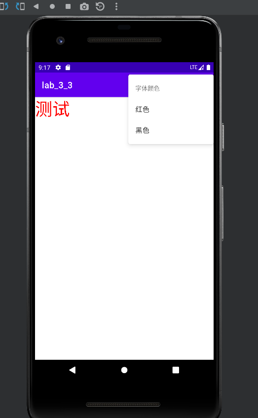
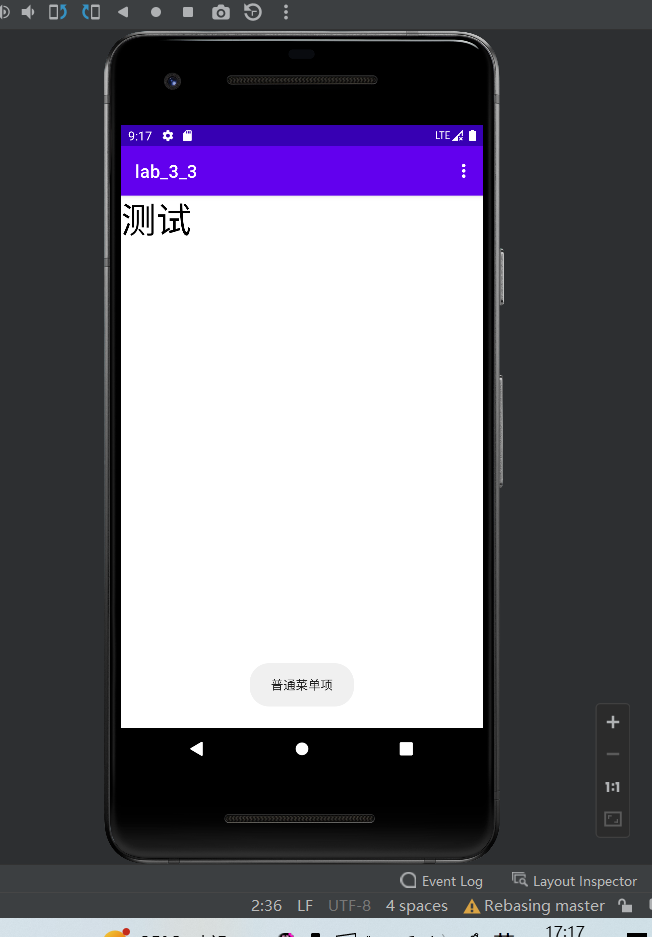

# Exp_03 Android界面组件实验
## 03_03 使用XML定义菜单
### 运行结果：




### 部分代码：
```
@Override
    public boolean onCreateOptionsMenu(Menu menu) {
        this.getMenuInflater().inflate(R.menu.custom_menu,menu);
        return true;
    }
@Override
    public boolean onOptionsItemSelected(MenuItem item) {
        switch (item.getItemId()) {
            case R.id.menu_font_small:
                textview.setTextSize(10*2);
                break;
            case R.id.menu_font_middle:
                textview.setTextSize(16*2);
                break;
            case R.id.menu_font_big:
                textview.setTextSize(20*2);
                break;
            case R.id.menu_normal:
                Toast.makeText(this, "普通菜单项", Toast.LENGTH_SHORT).show();
                break;
            case R.id.menu_color_red:
                textview.setTextColor(Color.RED);
                break;
            case R.id.menu_color_black:
                textview.setTextColor(Color.BLACK);
                break;
        }
        return true;
    }
```
### 部分代码2
```
<?xml version="1.0" encoding="utf-8"?>
<menu xmlns:android="http://schemas.android.com/apk/res/android">
    <item android:title="@string/menu_Font">
        <menu>
            <item
                android:id="@+id/menu_font_small"
                android:title="@string/menu_font_small"/>
            <item
                android:id="@+id/menu_font_middle"
                android:title="@string/menu_font_middle"/>
            <item
                android:id="@+id/menu_font_big"
                android:title="@string/menu_font_big"/>
        </menu>

    </item>
    <item
        android:id="@+id/menu_normal"
        android:title="@string/menu_Normal">
    </item>
    <item android:title="@string/menu_Color">
        <menu>
            <item
                android:id="@+id/menu_color_red"
                android:title="@string/menu_color_red" />
            <item
                android:id="@+id/menu_color_black"
                android:title="@string/menu_color_black"/>
        </menu>
    </item>
</menu>
```