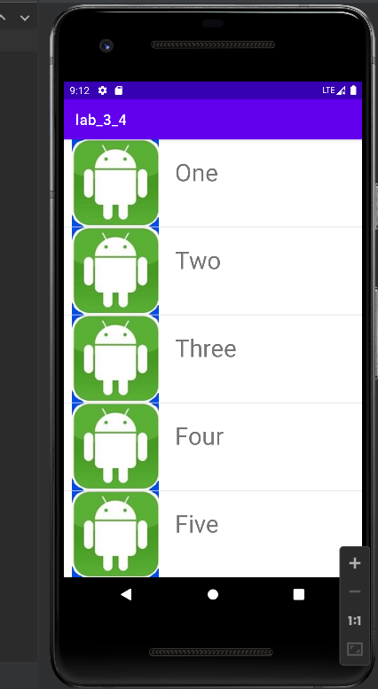

# Exp_03 Android界面组件实验
## 03_04 创建上下文操作模式(ActionMode)的上下文菜单
### 运行结果：


### 部分代码：
```
ublic void onCreate(Bundle bb){
        super.onCreate(bb);
        setContentView(R.layout.activity_main);
        final SimpleAdapter adapter=new SimpleAdapter(this,getData(),R.layout.itrms,new String[]{"title","image"},new int []{R.id.textt,R.id.imm});
        ListView listView=(ListView)findViewById(R.id.list);
        listView.setAdapter(adapter);
        listView.setOnItemClickListener(new AdapterView.OnItemClickListener() {
            @Override
            public void onItemClick(AdapterView<?> adapterView, View view, int i, long l) {
                view.setSelected(true);
                int ll=adapter.getCount();
                startActionMode(mCallBack);

            }
        });

    }
```